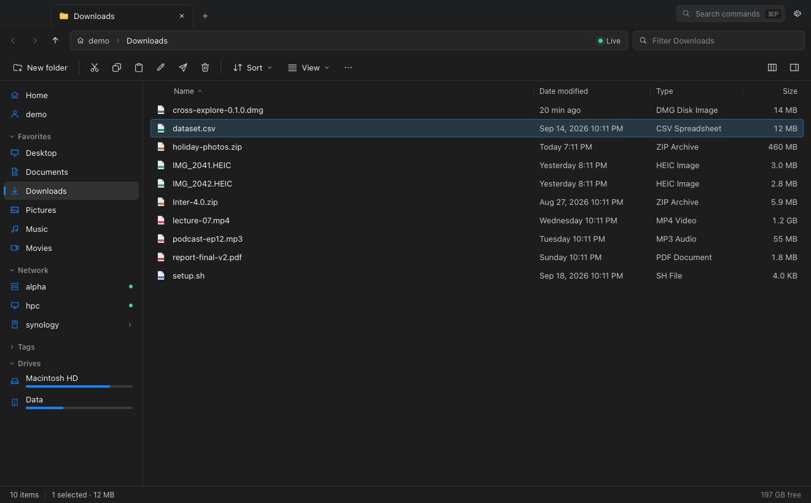
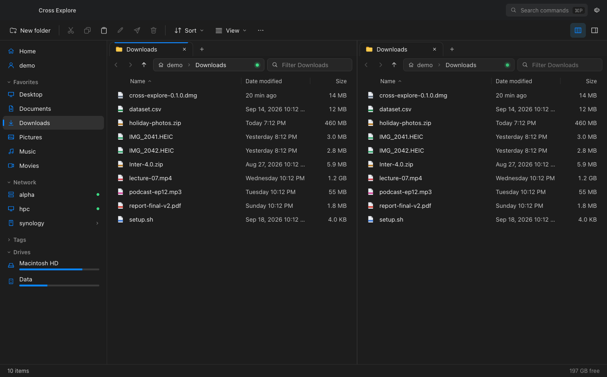
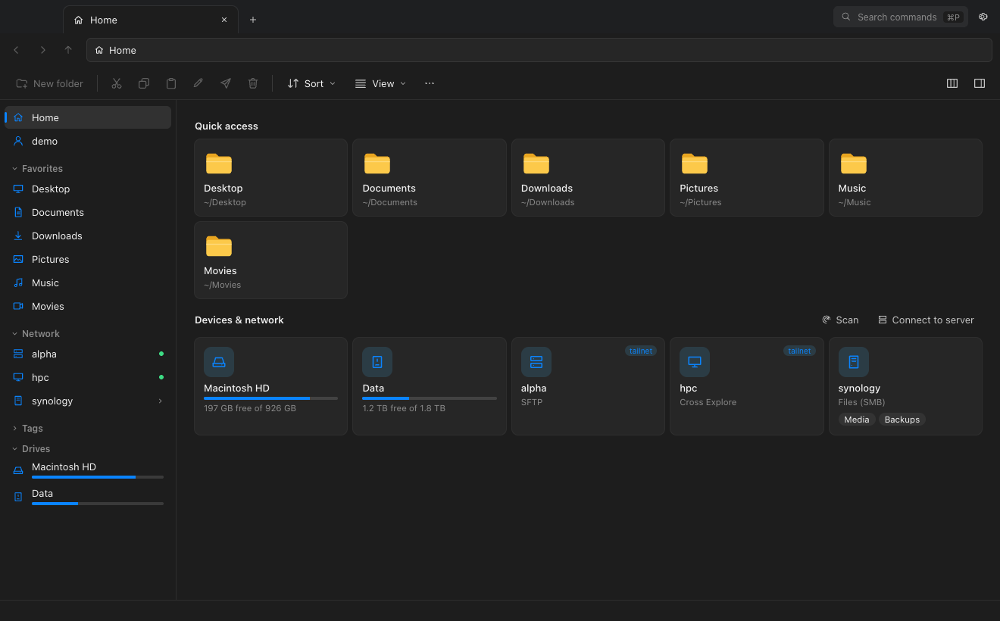
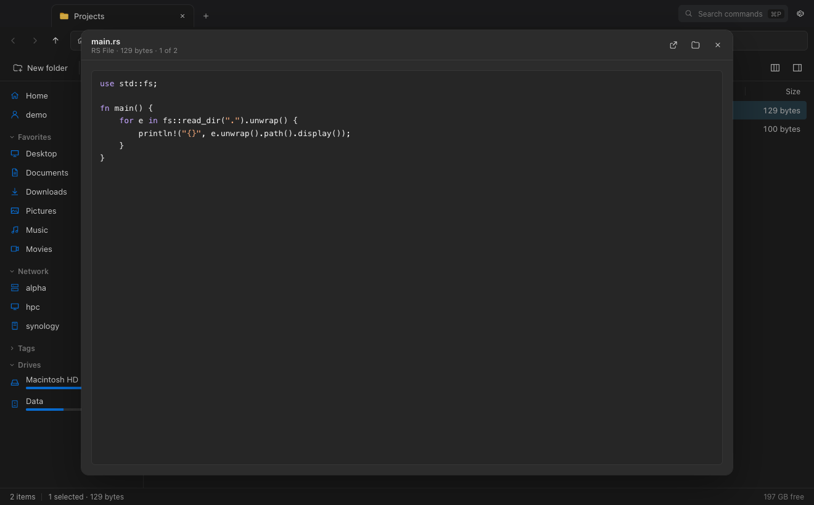
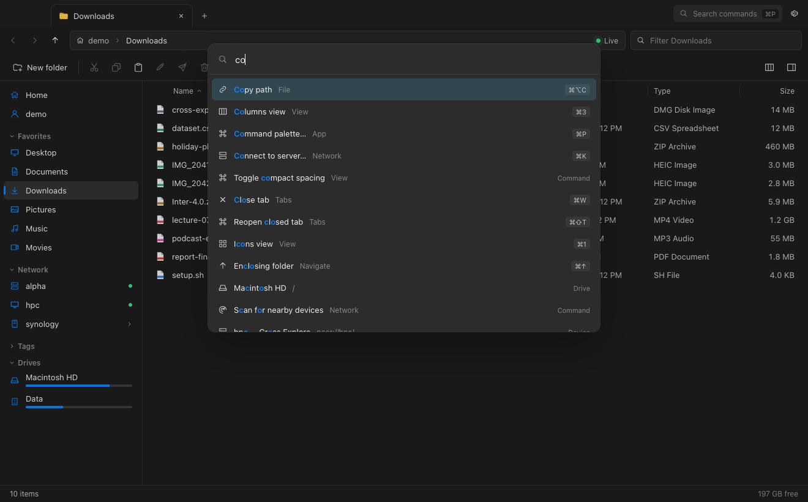
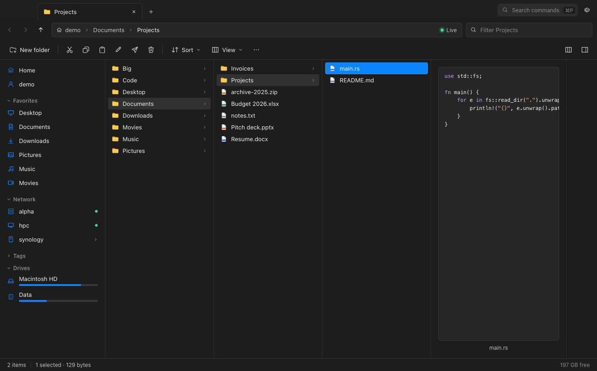
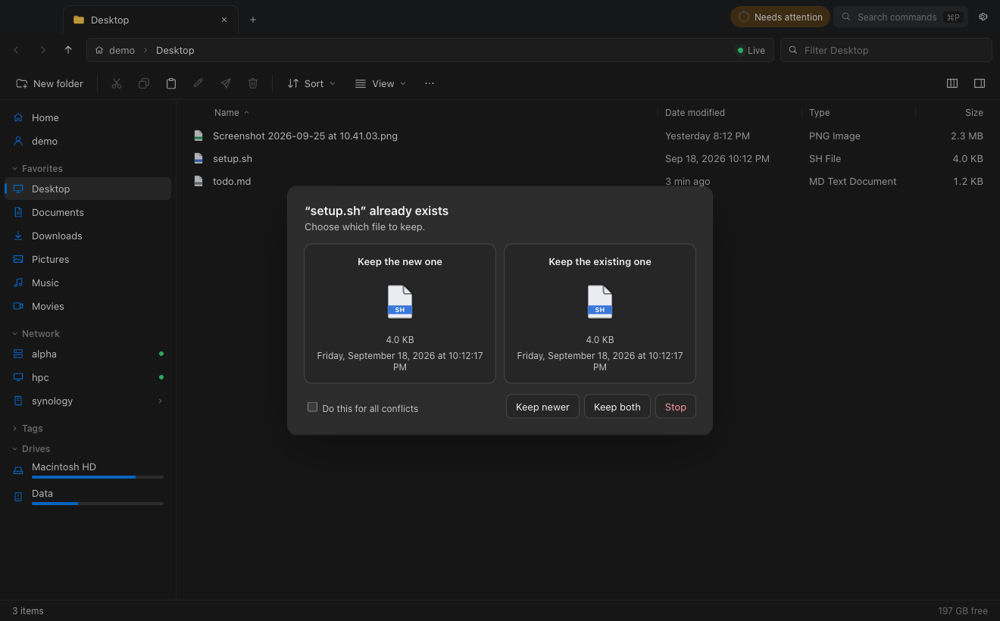
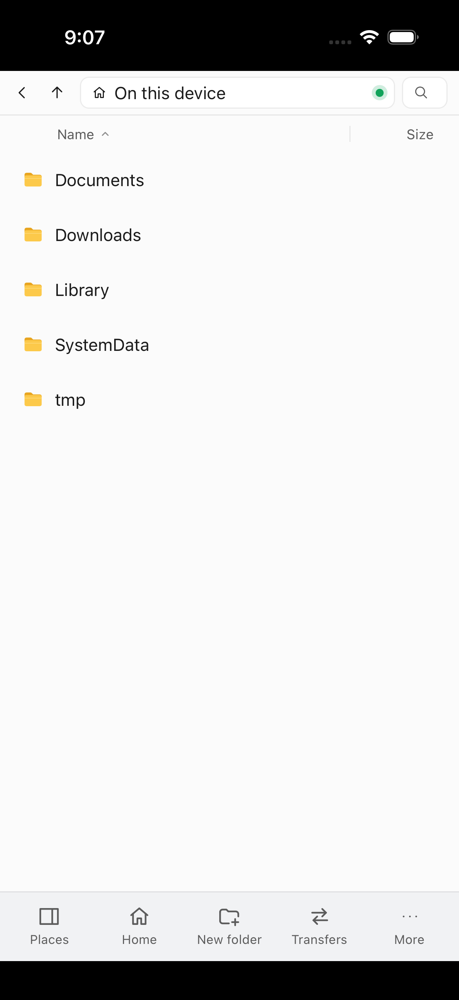
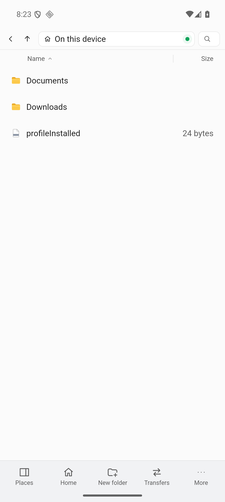

# Cross Explore

A fast, **live**, cross-platform file explorer for your computer, your network and your
tailnet. It has the look of Windows 11 Explorer, the live updates and Quick Look of the
macOS Finder, and the power tools of Total Commander and Commander One. It speaks
SMB, SFTP, FTP/FTPS, WebDAV and S3, finds shares on your LAN and Tailscale tailnet by
itself, and lets your own devices browse each other directly (peer mode).

Built with Rust (Tauri 2) and Svelte 5. The macOS installer is about 9 MB, and the app is
17 MB installed.



| | |
|---|---|
|  |  |
|  |  |
|  |  |

<p align="center">
   &nbsp;
  
</p>

## Features

**Live by default.** Folders never need refreshing:
- Local changes (FSEvents, ReadDirectoryChangesW, inotify) reach the screen in about 40 ms.
- SMB shares and paired Cross Explore devices push their changes too.
- SFTP, FTP, WebDAV and S3 folders re-check themselves (fast when active, backing off when
  idle) and refresh immediately after your own operations.
- New files glow briefly as they appear.

**Explorer-style chrome**
- Tabs in the title bar, a breadcrumb that turns into an editable path, and chevron menus for subfolders.
- A command bar, a navigation pane, and a Home page with pinned and recent folders,
  drives, nearby devices and recent transfers.
- Mica on Windows 11 and vibrancy on macOS.

**Finder niceties**
- Quick Look with the space bar: images, video, audio, PDF, code with highlighting,
  Markdown, fonts, archive contents and folders. Arrow keys flip through items while it's open.
- Column (Miller) view and gallery view with a filmstrip.
- A preview/info pane, colored tags (real Finder tags on macOS) and spring-loaded folders.

**Commander power**
- Dual pane with its own tabs per pane. F5/F6 copy or move to the other pane.
- An optional "Commander keys" preset: F3 view, F7 new folder, F8 delete, Tab to switch panes, Insert to select.
- Type-to-filter, select and deselect by pattern, and invert selection.
- Multi-rename with a live preview: tokens, counter, regex, case changes.
- Compare & sync folders across any two locations, and a side-by-side file diff.
- Archives as folders (zip, tar.*, 7z) plus compress and extract.
- Folder sizes, recursive name and content search, and a hotlist plus saved workspaces.
- An embedded terminal (Ctrl+\`) that opens in the current folder, or as SSH for SFTP folders.

**Transfers**
- A job queue with progress, speed sparkline, ETA, and pause/resume/cancel.
- Parallel streams per server, and resume after network hiccups.
- Server-side copies where possible: APFS/Btrfs clones, SMB copy-chunk, SFTP copy-data, WebDAV/S3 COPY.
- A visual conflict resolver: Replace, Skip, Keep both or Keep newer, optionally applied to all.
- Undo (Ctrl/⌘+Z) for copy, move, rename, new folder and move to Trash, including restoring from the real Trash.
- Interrupted jobs come back, paused, after a restart.

**Network**
- A Connect dialog for SMB, SFTP (password, key file, ssh-agent or `~/.ssh` keys), FTP/FTPS,
  WebDAV (Basic/Digest) and S3-compatible storage (AWS, R2, B2, Wasabi, MinIO).
- Passwords are stored in the OS keychain. SSH host keys, and FTPS certificates that aren't publicly trusted, are shown for review before you trust them.
- **Nearby** devices appear on their own via mDNS, Tailscale, SSDP, WS-Discovery, NetBIOS and port probes, with
  one-click shares. Nothing connects without you.

**Peer mode (your devices, directly)**
- Turn on sharing and pick folders.
- Pairing uses a 6-digit code over a password-authenticated key exchange (SPAKE2). Your own devices on your tailnet can trust each other automatically.
- Remote folders are live, transfers run over QUIC at about 230 MB/s on loopback, and "Send to device…" works like AirDrop.
- `cx serve` runs the same thing headless on a NAS or server.

**Everywhere**
- macOS, Windows 11 and Linux desktops.
- iOS and Android apps with a touch layout: a bottom bar, a drawer, long-press to select, and 48 px rows.

**Keyboard and mouse are equal**
- Every action is a command with platform-appropriate shortcuts.
- A command palette (⌘P / Ctrl+P) fuzzy-searches commands, tabs, folders, devices and paths.
- Drag and drop works within the app, from other apps, and out to other apps. The system clipboard carries files both ways.

## Layout

```
crates/
  cx-core       Locations (URIs), entries, Provider trait, Vfs connection registry, polling
  cx-local      Local provider, live watcher, restorable trash
  cx-smb        SMB2/3 (pure Rust, CHANGE_NOTIFY live watch, server-side copy)
  cx-sftp       SFTP over SSH (russh), known_hosts, agent/keys, copy-data
  cx-ftp        FTP / FTPS with a connection pool, MLSD and LIST fallback
  cx-webdav     WebDAV (streamed PROPFIND, Basic/Digest)
  cx-s3         S3-compatible object storage (own SigV4, multipart)
  cx-peer       Peer mode: QUIC, pairing, shares, live watch, send-to-device
  cx-discovery  mDNS, Tailscale, SSDP, WS-Discovery, NetBIOS, port probes
  cx-transfer   Job engine: copy/move/delete/trash, conflicts, resume, undo, compare/sync
  cx-archive    Archives as folders, compress/extract
  cx-search     Name and content search, fuzzy ranking
  cx-thumbs     Thumbnails (image crate + QuickLook / shell / CLI), text previews
  cx-term       PTY sessions for the embedded terminal
  cx-cli        `cx` headless peer server and client
  cx-testkit    In-memory provider for tests
  cx-bench      Performance budget checks
app/
  src-tauri     Tauri shell: IPC commands, cxfile:// + cxthumb:// streaming, setup
  src           Svelte 5 UI (views, panes, dialogs, command registry, stores)
  tests         UI smoke, screenshot and performance tests (Chrome DevTools protocol)
docker/         Real test servers: SFTP, FTP, SMB, WebDAV, S3; Linux build image
docs/PLAN.md    The design and roadmap this was built from
```

## Build and run

Requirements: Rust 1.92+, Node 20+. On Linux you also need `libwebkit2gtk-4.1-dev libgtk-3-dev librsvg2-dev libssl-dev libdbus-1-dev libxdo-dev`
(see `docker/linux-build/Dockerfile`).

```sh
cd app
npm install
npx tauri dev                   # desktop app with hot reload
npx tauri build                 # release bundle (.app/.dmg, .msi/.exe, .deb/.AppImage)
npm run dev                     # UI only, in a browser, against an in-memory mock backend
                                #   http://localhost:1420/?path=~/Downloads

# Mobile (needs Xcode / Android SDK + NDK; set NDK_HOME)
npx tauri ios build --debug --target aarch64-sim
npx tauri android build --debug --target aarch64 --apk

# Headless peer server for a NAS or server
cargo run -p cx-cli --release -- serve --share Media=/srv/media:ro
```

## Tests

| What | Command |
|---|---|
| All unit and integration tests (252) | `cargo test --workspace` |
| Live protocol tests against real servers in Docker | `docker/test-remote.sh sftp\|ftp`, `docker/test-remote-2.sh smb\|webdav`, `docker/test-s3.sh` |
| **End to end in the real app** (real webview + real backend) | `CX_SELFTEST=1 target/debug/cross-explore` |
| … plus every protocol (servers from `docker/` running) | `CX_SELFTEST=1 CX_SELFTEST_REMOTE=1 target/debug/cross-explore` |
| UI smoke test (browser preview) | `npm run dev & node app/tests/ui-smoke.mjs` |
| UI performance budgets (100k-item folder) | `node app/tests/ui-perf.mjs --check` |
| Backend performance budgets | `cargo run -p cx-bench --release -- --check` |
| Linux build + tests | `docker build -f docker/linux-build/Dockerfile -t cx-linux . && docker run --rm cx-linux` |
| Windows compile check (from macOS) | `cargo xwin check --target x86_64-pc-windows-msvc -p cross-explore` |

The in-app self test covers:
- Browsing, and live updates from outside the app.
- New folder, rename and undo; copy and duplicate; trash and restore.
- Previews, streamed bytes with ranges, and thumbnails.
- Search, zip compress/browse/extract, tags, compare, folder sizes and all four views.
- The embedded terminal, peer mode and discovery.
- Sign-in, browse, upload, preview, rename and delete on SFTP, SMB, WebDAV, FTP, FTPS and S3.

### Measured (Apple silicon, release)

| | Result |
|---|---|
| First rows of a 100k-item folder on screen | 39 ms (backend first batch: 0.5 ms) |
| 100k items listed / sorted / filtered | 257 ms / 36 ms / 21 ms |
| Scrolling 100k rows | 60 fps (37 rows in the DOM) |
| File changed on disk → row updated | ~40–50 ms |
| Peer transfer (QUIC, loopback) | ~230 MB/s |
| Installer / app size (macOS) | 8.7 MB / 17 MB |

## Keys

| | macOS | Windows / Linux |
|---|---|---|
| Command palette | ⌘P | Ctrl+P |
| Quick Look | Space | Space |
| Open / rename | ⌘O / ↩ | Enter / F2 |
| Enclosing folder, back, forward | ⌘↑, ⌘[, ⌘] | Alt+↑, Alt+←, Alt+→ |
| Filter / search subfolders | type, ⌘F / ⌘⌥F | type, Ctrl+F / Ctrl+Shift+F |
| Copy, cut, paste, duplicate, undo | ⌘C ⌘X ⌘V ⌘D ⌘Z | Ctrl+C X V, Ctrl+Shift+D, Ctrl+Z |
| Move to Trash / delete permanently | ⌘⌫ / ⌘⌥⌫ | Del / Shift+Del |
| New folder, new tab, close tab | ⌘⇧N, ⌘T, ⌘W | Ctrl+Shift+N, Ctrl+T, Ctrl+W |
| Views: icons, details, columns, gallery | ⌘1 ⌘2 ⌘3 ⌘4 | Ctrl+Shift+2 6 7 8 |
| Dual pane / preview pane / terminal | F9 / ⌘⇧P / ⌃\` | F9 / Alt+P / Ctrl+\` |
| Connect to server / settings | ⌘K / ⌘, | Ctrl+K / Ctrl+, |
| Commander preset | F3 view · F5 copy · F6 move · F7 new folder · F8 delete · Tab switch pane · Insert select · Num+ / Num- / Num* select | same |

## Known limitations

- **Windows:** the desktop build compiles for Windows (checked with `cargo xwin`), but hasn't been run
  on Windows. The custom caption buttons replace Windows 11's snap-layout flyout.
- **Linux:** the Linux build and its tests pass in Docker, but the UI hasn't been run on a Linux desktop.
- **Phones:** the apps are mainly network and peer clients. They browse their own app storage only
  (no system-wide file access), and there's no trash, terminal or drag-out.
- **Remote watching:** SFTP, FTP, WebDAV and S3 folders update by polling; only SMB and peers push changes.
- **Speed:** FTP and FTPS transfers set up a data connection each time, so they are slower than the other protocols for small files.
- **Not built yet:** rsync-style delta sync, cloud drives beyond S3 (Google Drive, OneDrive), a plugin API and an auto-updater.
- **Untested:** native drag-out to other apps and the OS-clipboard file exchange have only been
  checked to compile; they need a real mouse and clipboard.
